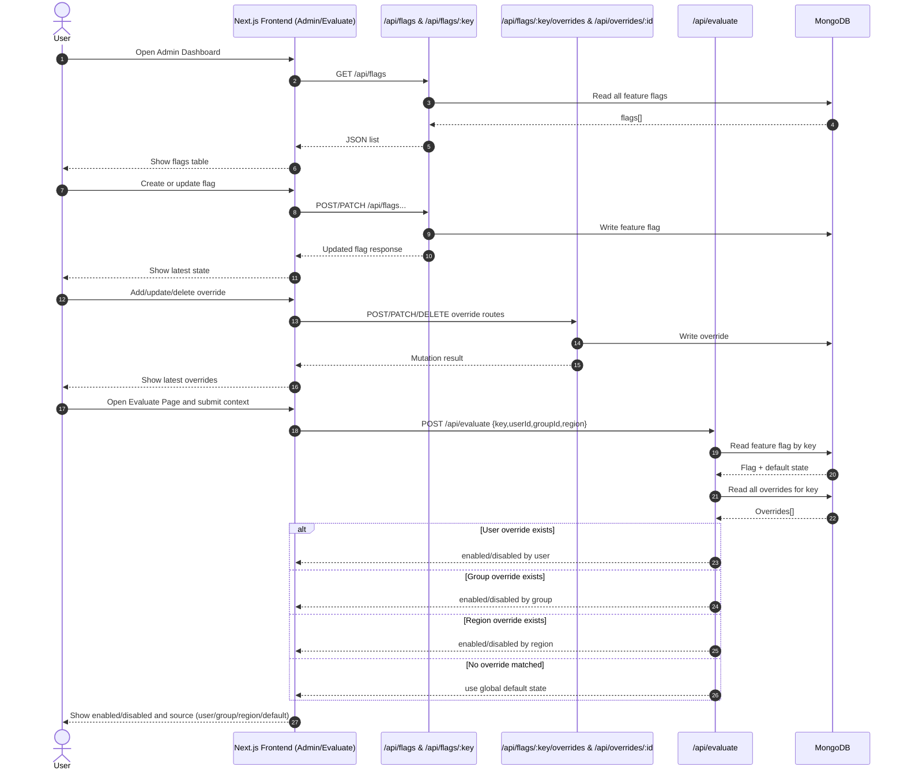

# Feature Flag Engine

## 1. Run Locally

### Prerequisites
- Node.js 20+
- npm 10+
- MongoDB Atlas cluster (or local MongoDB instance)

### Steps
1. Install dependencies

```bash
npm install
```

2. Create `.env.local`

```bash
MONGODB_URI="<your-mongodb-connection-string>"
```

3. Start the app

```bash
npm run dev
```

4. Open the app
- Admin dashboard: `http://localhost:3000`
- Evaluation page: `http://localhost:3000/evaluate`

## 2. Documentation

### 2.1 High-Level Overview
This app is a simplified feature flag engine.

It lets you:
- Define feature flags with a global default state.
- Add overrides for `user`, `group`, and `region`.
- Evaluate a feature at runtime using context inputs.

Evaluation precedence:
1. `user` override
2. `group` override
3. `region` override
4. global default

### 2.2 Tech Stack
- Framework: Next.js (App Router, Route Handlers)
- Language: TypeScript
- Database: MongoDB
- ODM: Mongoose
- Validation: Zod
- UI: Tailwind CSS + reusable shadcn-style components
- Deployment: Vercel

### 2.3 Model Schemas

#### FeatureFlag
- `key: string` (required, unique, trimmed)
- `defaultState: boolean` (required)
- `description: string` (optional, defaults to empty)
- `createdAt`, `updatedAt` (timestamps)

#### Override
- `featureKey: string` (required, indexed)
- `type: "user" | "group" | "region"` (required)
- `target: string` (required)
- `state: boolean` (required)
- `createdAt`, `updatedAt` (timestamps)

Unique compound index on override:
- `(featureKey, type, target)`

### 2.4 API Routes

#### Flags
- `GET /api/flags`
- Description: List all flags.

- `POST /api/flags`
- Description: Create a new flag.
- Body:

```json
{
  "key": "new_checkout",
  "defaultState": false,
  "description": "Enable the new checkout flow"
}
```

#### Single Flag
- `GET /api/flags/:key`
- Description: Get a single flag and all its overrides.

- `PATCH /api/flags/:key`
- Description: Update global default state and/or description.
- Body:

```json
{
  "defaultState": true,
  "description": "Updated description"
}
```

- `DELETE /api/flags/:key`
- Description: Delete the flag and its related overrides.

#### Overrides
- `POST /api/flags/:key/overrides`
- Description: Create an override for a flag.
- Body:

```json
{
  "type": "user",
  "target": "u_123",
  "state": true
}
```

- `PATCH /api/overrides/:id`
- Description: Update an existing override.
- Body:

```json
{
  "target": "u_456",
  "state": false
}
```

- `DELETE /api/overrides/:id`
- Description: Delete an override.

#### Evaluation
- `POST /api/evaluate`
- Description: Evaluate whether a feature is enabled for a given context.
- Body:

```json
{
  "key": "new_checkout",
  "userId": "u_123",
  "groupId": "g_premium",
  "region": "EU"
}
```

- Response:

```json
{
  "key": "new_checkout",
  "enabled": true,
  "reason": "user",
  "matchedOverride": {
    "featureKey": "new_checkout",
    "type": "user",
    "target": "u_123",
    "state": true
  }
}
```

### 2.5 Architecture Design



### 2.6 AI Usage Disclosure
- This project was built with assistance from Codex.
- The core product direction, stack choice, and implementation plan were defined by me.
- I used AI as a coding assistant to speed up execution and unblock specific implementation issues.

How AI was used in this project:
- Scaffold and refine parts of API handlers and UI boilerplate.
- Debug TypeScript, Next.js route typing, and build errors.
- Improve documentation quality and consistency.
- Review and iterate on architecture explanation and endpoint clarity.

How AI was not used:
- It did not choose the problem approach, stack, or project scope for me.
- Final technical decisions, code review, and submission ownership remain mine.

### Notes
- Caching is in-memory and instance-local.
- In serverless environments, cache is best-effort and short-lived.
- This project is intentionally auth-free for assignment scope.
- Unit tests were skipped due to time constraints and limited familiarity, with focus placed on delivering the full end-to-end feature set.

## 3. If I Had More Time
- Add authentication and role-based access control (admin/editor/viewer).
- Add unit tests for core evaluation logic and API routes (especially precedence and edge cases).
- Add percentage rollouts (for gradual release strategies).
- Add audit logs for all flag and override mutations.
- Add monitoring and alerting for API errors and evaluation latency.
